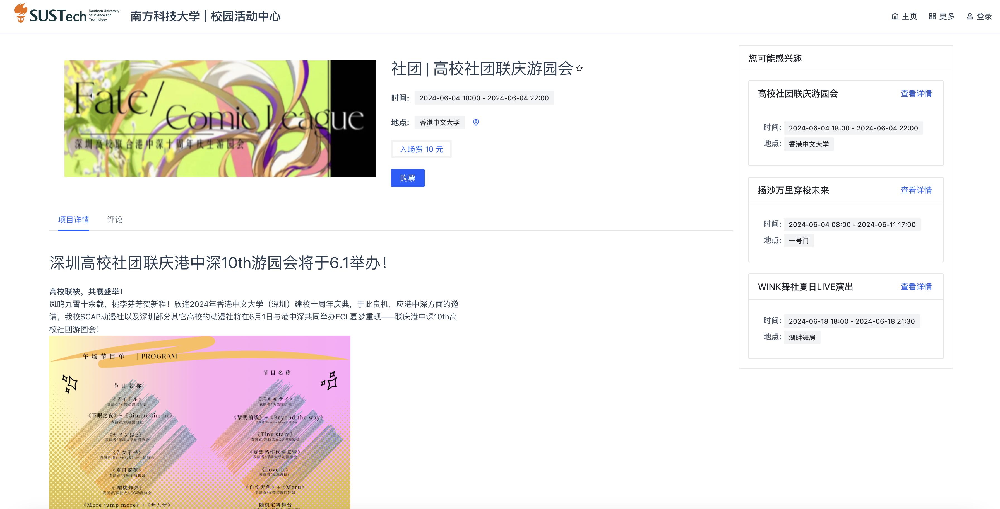

# 1 Introduction

Campus-Event-System(CES) is a platform provide service with editing, releasing, exploring and managing activities (events) for institutes like university. In addition, this is a course project of CS304, SUSTech.

## 1.1 User Features

- **Exploring**
  Explore all kinds of events in different categories and book tickets. CES provides rich information in forms like image and map for event to display.
- **Comments**
  Make comments with **videos and photos**.
- **Recomemndations**
  **Star** your favorite events and receive **customize recommendations**.
- **Order Service**
  Purchase by **Alipay** and manage your orders with interact-friendly UI.
- **Check in with tickets**
  Receive your personal and unique ticket with **QR code** for entering events.
- **Mail Service**
  CES provides notifications through mail.

## 1.2 Manager Features

- **Smooth Workflow**
  CES provides a workflow including **editing your event as scratch**, realeasing your scratch for reviewer to **audit** and finally publish to the users.
- **Permission Control**
  CES provides service for higher level managers to **control the permission of users**, which is very important for institute like university to manage.
- **Personal Image Host**
  CES provides service for event editors to **upload his/her images** like many hot platforms do.
- **Customize your events**
  For editing, CES supports **markdown** document to describe events. For tickets, CES supports adding **multiple kinds of tickets with different number and price**. For images, CES supports editor to **upload one cover image and multiple introducting images**.
- **Check in tickets**
  For entering the event, CES also provides **convenient ticket check service**.
- **Global Settings**
  CES suppots manager to configure the system including amap api, order expire time, max upload images, and etc.

# 2 Manual Book

For RESTful API of the back-end, please refer to ``api-docs.md``. For deployment, please refer to ``sprint2-2.md`` ``Section 5 Deployment``.

## 2.1 User Front-end

### 2.1.1 Register & Login

Tap "登录" to register and login.

### 2.1.2 Change Profile

Tap "个人信息" to change your profile and upload your avatar.

### 2.1.3 Explore Events

Explore all kinds all events.

### 2.1.4 Make Comment

Click any event and make comments with images and videos.

### 2.1.5 Book Ticket

After login, you can book ticket by press the "购票" button, which will lead you to an Alipay page.

### 2.1.6 Star Event

From the event info page, you can see a star at it, and you can find all your stars at your personal page.

## 2.2 Manager Front-end

### 2.2.1 Create and Edit Event

### 2.2.2 Global Setting

We provide a lot of settings, allowing you to customize your system. This page can only be viewed by institute manager or super admin.

### 2.2.3 Permission Control

The institute manager and super admin can control the permission of users.

#### 2.2.4 Check In TIckets

You can check in ticket here.

