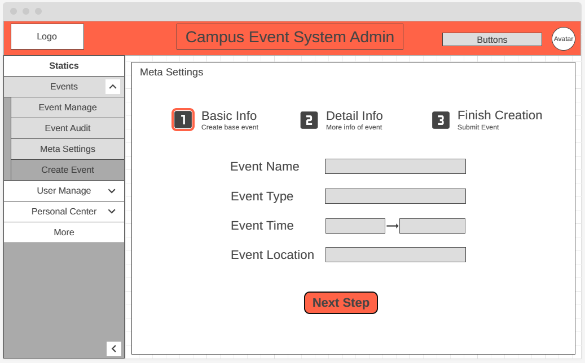

<h1>
Campus Events and Entertainment Center
</h1>

<b>Team</b>: 2

<b>Members</b>: 伦天乐，冯泽欣，罗嘉诚，苏军又，徐霄阳

## 1 Project Architecture && UI Design

### 1.1 Architecture

**Description**:

Accoridng to our expectation of the number of our target user, monolithic architecture is enough. 

We split our back-end into 3 layers: DAO layer which provides service for accessing and managing data in database and transfering data to objects, service layer which provide service based on the objects loaded from database, controller layer which provide RESTful API for front-end. In addition, we implement OSS service with Minio and payment service with Alipay SDK.

Our front-ends includes two system: user-end system and manage system which are all developed with Vue 3.0 framework.

### 1.2 UI Design

#### 1.2.1 User End

**Description**: The 3 images shows the main 3 pages of user-end system which are homepage, exploring events and view event detail for purchasing.

#### 1.2.2 Administrator End

**Description**: These pages show the main function of managing system.

