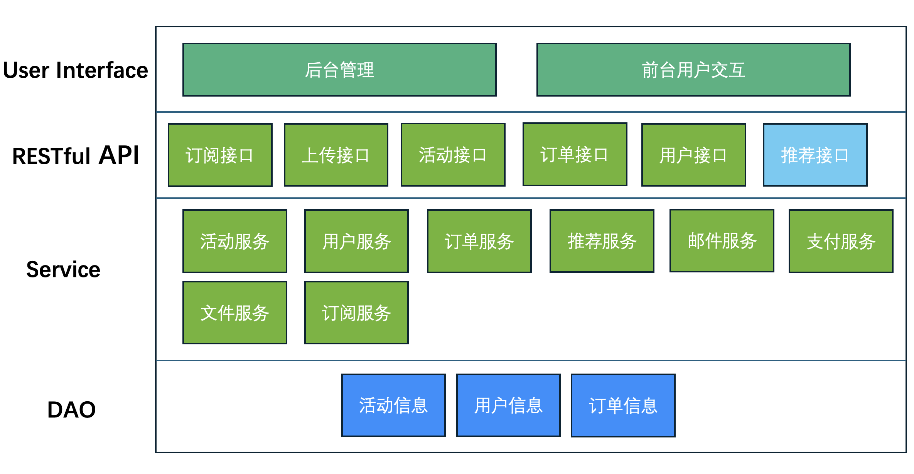
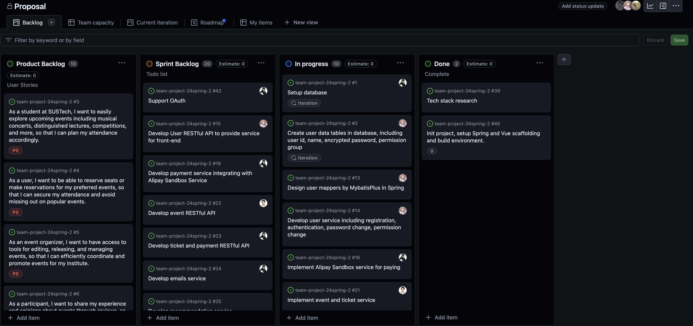
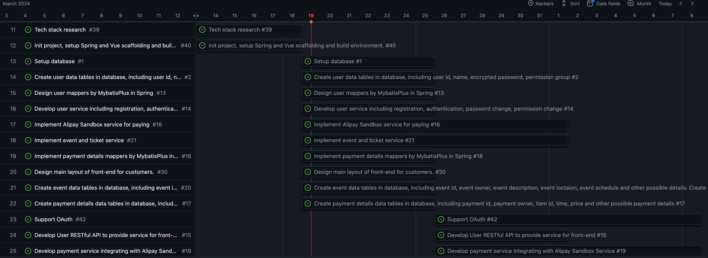

<h1><center>Campus Events and Entertainment Center</center></h1>

<center><b>Team</b>: 2</center>

<center><b>Members</b>: 伦天乐，冯泽欣，罗嘉诚，苏军又，徐霄阳</center>

## 1 Project Overview

### 1.1 Target Users

- Our clients include institutes like universities and campus that need a system to manage events and allow users to reserve events, book tickets and write reviews.
- The user of the system are mainly students.

### 1.2 Functionalities

- A well designed website that allow users to register, login, view events, reserve events, book tickets, share details of events instantly and write reviews.
- A well designed managing platform that allow administrators to release events, edit events, delete events and manage tickets.

### 1.3 Overall goal

- A event managing system that can provide service to users in campus.

## 2 Preliminary Requirement Analysis

### 2.1 Functional Requirements

- **Event Exploration and Reservation**
  Users can easily explore a variety of events including school performances, lectures, competitions, and more. They can view detailed information such as **categories, venue maps, and event schedules**. Additionally, users can **reserve seats or make reservations** for their preferred events.
- **Convenient Ticket Booking with Alipay**
  Integrated with **Alipay**, users can seamlessly book tickets for events, making the payment process secure and convenient.
- **Interactive Review System**
  Users can share their experiences and opinions through various mediums such as **video clips, pictures, and text reviews**. This feature fosters community engagement and helps others make informed decisions about attending events.
- **Subscription Service**
  Users can **subscribe to receive the latest news** and updates about upcoming events through **email notifications**. This ensures that users stay informed about relevant events and activities.
- **Event Management Tools**
  Event organizers have access to tools for **editing, releasing, and managing events** specific to their institutes. This feature streamlines the event management process and allows for efficient coordination and promotion.
- **Personalized Recommendations**
  The system **utilizes user preferences and behavior** to provide personalized event recommendations, enhancing the overall user experience and increasing engagement with the platform.
- **Easy to deploy**
  The system provide deploy tools like **docker**.
- **User Roles and Permissions**
  Define different user roles based on their responsibilities and permissions within the system, such as event submitter, event editor, event auditor, and event approver.
- **Authentication**
  User can register and login with email and password. Also the system allow users to login by **OAuth**.

### 2.2 Non-functional Requirements

- **Usability:**
  - The user interface should be intuitive and easy to navigate, catering to users of varying technological proficiency.
- **Safety and Security:**
  - User data, including personal information and payment details, must be encrypted to ensure confidentiality and prevent unauthorized access.
  - Implement CAPTCHA (Completely Automated Public Turing test to tell Computers and Humans Apart) verification during critical actions such as user registration, login, and sensitive transactions.
- **Performance:**
  - The system should be able to handle a large number of concurrent users.
  - Response times for critical functions such as event search, ticket booking, and user authentication should be optimized to ensure a seamless user experience.
  - Scalability should be built into the architecture to accommodate future growth and spikes in user activity.
- **Reliability and Availability:**
  - The platform should have a high level of reliability, with minimal downtime and service interruptions.
  - Redundancy and failover mechanisms should be implemented to ensure continuous availability, even in the event of hardware or software failures.

### 2.3 Data Requirements

- User Data
  - Email address, user name and user password from registration
  - Payment details when booking ticket generated by our system and Alipay Platform.
  - User interest points generated by user interaction with our system.
- Event data
  - Event information edited by administrator, including tickets, location, map and description.
  - Comments, video clips and other reviews made by users.

### 2.4 Technical Requirements

- **Operating System**
  Docker is supported and hence the system can be built on Windows, Mac OS, Linux, etc.
- **Tech Stack**
  - **Spring** + **Java** + **Maven**
    The system back-end is developed by Java using SpringBoot framework. And we use Maven to manage packages.
  - **Vue 3.x** + **TypeScript/JavaScript** + **HTML** + **CSS** + **NPM**
    The system front-end is developed by HTML and CSS using Vue 3.x framework. And we use NPM to manage packages.
  - **PostgresSQL** + **Mybatis Plus**
    The data is stored in database by PostgresSQL. The DAO is mainly developed using Mybatis Plus.
  - **Git**
    The system uses Git for version control.
  - **Arco Design**
    Design system developed by ByteDance.
  - **Gaode Amap** / **OpenStreetsMap** / **Baidu Map**
    Provide map service for events.
  - **Docker**
    Container application that provide easy deployment.
  - **Alipay Sandbox**
    Virtual paying service for developers.
- **Project Architecture**
  According to our target users, distributed architecture seems overengineering hence we choose monolithic and layered architecture.
  

## 3 Task Decomposition & Planning





## 4 AI Usage

- **Have you used AI to propose features for the project?**
  Yes, we have ask ChatGPT to provide advice of frontier tech stack in industry of web developing currently. One example of prompts we have used is

  ```
  I'm currently develop a web project based on SpringBoot and Vue 3.0. Provide me with some frontier framework or tech stack for brainstorm.
  ```

  The answer is long and here is a shortcut.

  ```
  Certainly! Here are some frontier frameworks and technologies that you might consider integrating into your Spring Boot and Vue 3.0 project:
  
  1. **GraphQL**: Instead of RESTful APIs, GraphQL provides a more efficient way to query and manipulate data. You can use libraries like Apollo Server for the backend and Apollo Client for the frontend.
  
  2. **Kotlin**: Kotlin is a modern programming language that runs on the JVM and is fully interoperable with Java. It can be used alongside Spring Boot to write concise and expressive code.
  
  ...
  
  Remember to assess the suitability of each technology based on your project requirements, team expertise, and long-term maintainability. Additionally, always prioritize learning and experimentation to stay updated with the latest advancements in web development.
  ```

- **Have you used AI to conduct the preliminary requirement analysis (e.g., identify functional and nonfunctional requirements)?**

  Yes, most of the requirement texts are first written by ChatGPT and then polished by us. The prompt is
  ```
  User
  I have a web project called Campus Events and Entertainment Center. Help me to descripe my features.
  
  ### Examples of WeChat
  WeChat Features
  1. Find your friends more easily
  Search and add friends directly via WeChat ID or mobile number. Start chatting
  once your friend request has been accepted.
  2. Start a free chat anytime and anywhere
  Whether you want to send messages or share photos and videos, you can chat freely
  through WeChat. Wherever you go, you can immediately get in touch with the people
  you care about using WeChat.
  
  ### My features
  - Explore and reserve events
  - Book tickets by Alipay
  - Comments and share your reviews in forms like video clips and pictures
  - Subscribe and get latest events news through emails
  - Edit, release and manage events for your institutes
  
  ### Further information
  Users can view information for school performances (e.g., musical concerts), distinguish lectures (e.g., by Turing Award recipients), competitions (football match, coding skill competitions), and other events. Users could also book tickets, make reservations, or write reviews. Specifically,
  - Users can explore specific information about various events, including categories, maps, venues, etc.
  - Users can make reservations, book seats, and purchase tickets for various events.
  - The system also supports user reviews, communication, assistance, and (real-time) information sharing (e.g., video clips, pictures, etc.) for events and activities
  - The system can provide event recommendations
  ...
  ```

  The answer is similar to the requirements mentioned above.

- **Have you used AI to generate user stories?**
  Yes, the prompt is as below:

  ```
  you need write user story from given features. Most important, you must using the format of user story.
  
  ### Format:
  As a <type-of-user>, I want to <some-goal> so that <some-reason>."
  
  ### Features:
  1. Event Exploration and Reservation
  Users can easily explore a variety of events including school performances, lectures, competitions, and more. They can view detailed information such as categories, venue maps, and event schedules. Additionally, users can reserve seats or make reservations for their preferred events.
  
  2. Convenient Ticket Booking with Alipay
  Integrated with Alipay, users can seamlessly book tickets for events, making the payment process
  secure and convenient.
  
  3. Interactive Review System
  Users can share their experiences and opinions through various mediums such as video clips, pictures, and text reviews. This feature fosters community engagement and helps others make informed decisions about attending events.
  
  4. Subscription Service
  Users can subscribe to receive the latest news and updates about upcoming events through email
  notifications. This ensures that users stay informed about relevant events and activities.
  
  5. Event Management Tools
  Event organizers have access to tools for editing, releasing, and managing events specific to their institutes. This feature streamlines the event management process and allows for efficient coordination and promotion.
  
  6. Personalized Recommendations
  The system utilizes user preferences and behavior to provide personalized event recommendations, enhancing the overall user experience and increasing engagement with the platform.
  
  7. Easy to deploy
  The system provide deploy tools like docker.
  
  8. User Roles and Permissions
  Define different user roles based on their responsibilities and permissions within the system, such as event submitter, event editor, event auditor, and event approver.
  
  9. Authentication
  User can register and login with email and password. Also the system allow users to login by OAuth.
  
  ### background:
  Please design and implement a "Campus Events and Entertainment Center" system, in which users can view information for SUSTech performances (e.g., musical concerts), distinguish lectures (e.g., by Turing Award recipients), competitions (football match, coding skill competitions), and other events. Users could also book tickets, make reservations, or write reviews.
  ```

  The sample output has been showed in the snapshots above.

- **Have you used AI to generate issues or tasks?**
  Yes, but it's unrealistic and does not match our requirements.
  Prompt:

  ```
  Here is a user story, help me do design tasks list:
  As a student at SUSTech, I want to easily explore upcoming events including musical concerts, distinguished lectures, competitions, and more, so that I can plan my attendance accordingly.
  ```

  Sample output:

  ```
    1. **User Interface Design:**
       - Design user-friendly interfaces for browsing upcoming events.
       - Create intuitive navigation menus and filters for different event categories (musical concerts, distinguished lectures, competitions, etc.).
       - Design event detail pages displaying relevant information such as event description, date, time, venue, and ticket availability.
       - Include interactive elements for users to view event locations on maps and share event details with others.
    2. **Event Categorization and Tagging:**
       - Define a taxonomy for categorizing events based on types (musical concerts, lectures, competitions, etc.).
       - Implement tagging system to label events with relevant keywords and topics.
       - Ensure consistency and clarity in event categorization and tagging to facilitate easy exploration for users.
    3. **Search Functionality:**
       - Develop a robust search feature allowing users to search for events by keywords, categories, dates, or locations.
       - Implement autocomplete suggestions to assist users in refining their search queries.
       - Optimize search algorithms to provide relevant and accurate results in real-time.
    4. **Event Recommendation System:**
       - Design algorithms to provide personalized event recommendations based on user preferences, past attendance history, and demographic information.
       - Implement machine learning models to continuously improve the accuracy of event recommendations over time.
       - Incorporate feedback mechanisms for users to rate recommended events and improve future recommendations.
    5. **Integration with External Data Sources:**
       - Identify and integrate with external data sources to gather information about upcoming events (e.g., event management platforms, campus event calendars, external event organizers).
       - Develop APIs or data connectors to retrieve event data in real-time and synchronize it with the platform's database.
    6. **Mobile Responsiveness:**
       - Ensure that the platform is fully responsive and optimized for mobile devices, allowing students to explore upcoming events on their smartphones and tablets.
       - Conduct usability testing on different mobile devices and screen sizes to ensure a seamless user experience across all platforms.
    7. **Performance Optimization:**
       - Optimize the performance of event listing pages and search functionality to handle a large volume of events and user queries efficiently.
       - Implement caching mechanisms to minimize load times and server response times for frequently accessed event data.
       - Conduct load testing to identify potential performance bottlenecks and scalability issues, and optimize system resources accordingly.
    8. **Accessibility Considerations:**
       - Ensure that the platform complies with accessibility standards, such as WCAG (Web Content Accessibility Guidelines), to accommodate users with disabilities.
       - Design user interfaces with clear visual cues, descriptive labels, and keyboard navigation support for users who rely on assistive technologies.
    9. **Feedback and Iteration:**
       - Implement feedback mechanisms, such as user surveys and feedback forms, to gather input from students about their experiences with exploring upcoming events.
       - Continuously iterate and improve the design based on user feedback and usability testing results to enhance the overall user experience.
  
  ```
  
  