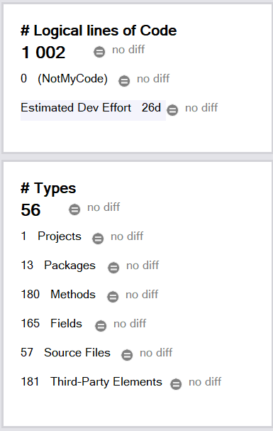
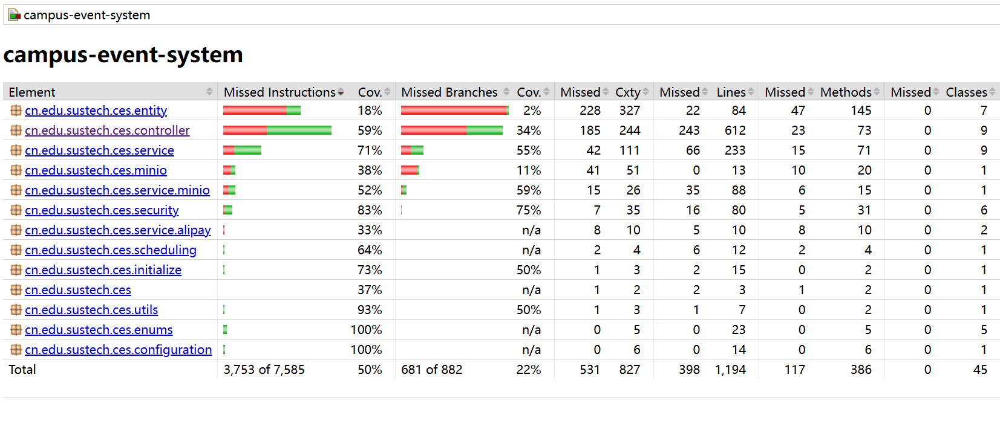
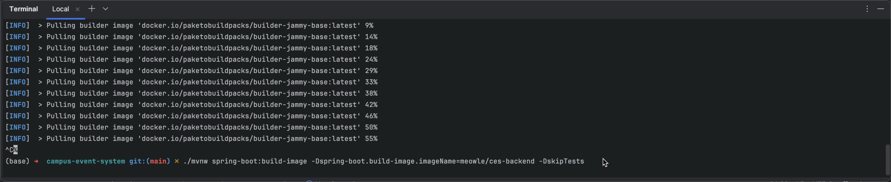
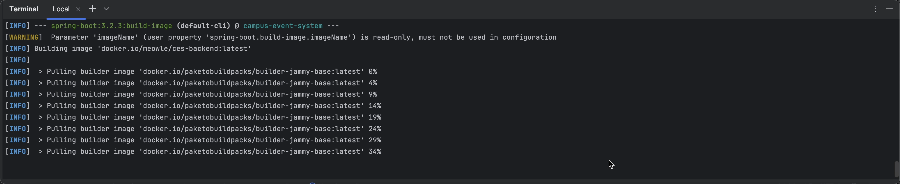
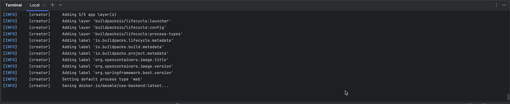
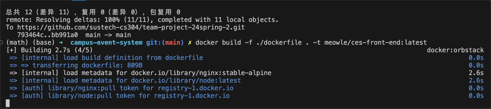
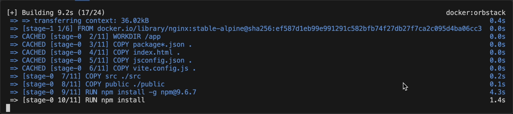
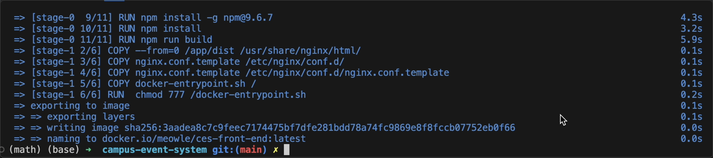

<h1><center>Campus Events and Entertainment Center</center></h1>

<center><b>Team</b>: 2</center>

<center><b>Members</b>: 伦天乐，冯泽欣，罗嘉诚，苏军又，徐霄阳</center>

## 1 Metrics

To quantitatively assess the quality of our project code, we utilized **JArchitect** tool to analyze and here are the results:

- **Lines of Code (LoC):** The project consists of a total of **1002 logical lines of code**. This metric is essential as it indicates the overall size and, indirectly, the complexity of the project. A higher count can often signify more functionality but also implies greater maintenance effort.

- **Number of Packages:** Our project is organized into **13 packages**. This modularization aids in maintaining separation of concerns and enhances the manageability of the codebase, crucial for mitigating complexity in larger projects.

- **Number of Source Files:** There are **56 source files** in the project. The number of files is a direct indicator of the project's scale and the granularity of its modular decomposition.

- **Number of Dependencies:** The project includes **181 third-party elements**. This metric reflects the project's reliance on external libraries and frameworks, which can add to the complexity by increasing the amount of external code that needs to be understood and managed.



**Notice:** The above metrics only include evaluation of back-end system code, because currently there are no effective tools for front-end evaluation and the 4 metrics are not suitable enough to evaluate a front-end system in Vue framework because of the difference of design style between back-end and front-end, as we have reserached.

## 2 Documentation

### 2.1 User Document

See ``README.md``.

### 2.2 Developer Document

As for RESTful API docs, please refer to ``api-docs.md``, which is export to json file by Postman and transform to markdwon by [docgen](https://github.com/thedevsaddam/docgen).

## 3 Tests

To ensure the quality of our project, we have implemented a comprehensive suite of automated testing strategies utilizing the **Spring-Boot-Starter-Test** package from Spring Boot. This package integrates a variety of mainstream testing libraries and tools, including **JUnit 5**, **Mockito**, and **AssertJ**, which aid in effectively conducting both unit and integration testing, thus ensuring robustness and correctness of functionalities.

### 3.1 Testing Technology and Tools

- **JUnit 5:** Provides the testing framework support, used for defining and executing test cases.
- **Mockito:** Utilized for mocking objects and behaviors, which is crucial in unit testing as it allows precise testing of components in isolation.
- **AssertJ:** Enhances assertion capabilities, making the validation of test results more intuitive and expressive.
- **Spring Boot Test:** Offers integration testing support, enabling testing of components in an environment close to production settings, including database interactions.
- **Jacoco:** Used for generating code coverage reports, which help in assessing the comprehensiveness and effectiveness of our tests.

### 3.2 Implementation and Outcomes of Testing

We have designed tests for all controllers and services. By employing Mockito for unit testing, we ensured the logical correctness and stability of each method. Additionally, we used Spring Boot Test for database integration testing to ensure that the application behaves as expected in real database environments.

To measure the effectiveness of our tests, we utilized Jacoco to generate a code coverage report, as shown in figure below, among which, the average statement coverage is **50%**, with **59%** in controller layer and **71%** in service layer.

The reason why the test does not cover all code is that we have implemented API that requires external access like ``alipay-notify``, which is an access point to receive encoded message from Alipay and email verification and notificaiton. In addition, there are a lot of configuration components like ``SpringSecurityConfiguration``, which is used for configuring **Spring Security**.



### 3.3 Effectiveness Evaluation

As shown in the figure above, we use Jacoco to generate the code coverage report, 


Our automated testing significantly enhances development efficiency and code quality. Detailed code coverage reports allow us to verify the efficacy of our tests. The high coverage achieved illustrates our ability to capture and address the majority of potential errors and issues, thereby reducing problems in production environments.

Overall, our automated testing strategy effectively supports rapid iteration and continuous integration, ensuring both the functional completeness and technical reliability of the project.

## 4 Build

### 4.1 Back-end build

The back-end developed in Spring framework is build with spring build plugin, here is part of ``pom.xml``:

```xml
<build>
    <plugins>
        <plugin>
            <groupId>org.springframework.boot</groupId>
            <artifactId>spring-boot-maven-plugin</artifactId>
        </plugin>
    </plugins>
</build>
```

And we simply run this in the back-end root directory to build docker image:

```bash
./mvnw spring-boot:build-image -Dspring-boot-build-image.imageName=meowle/ces-backend -DskipTests
```

The screenshots are as below:







### 4.2 Front-end build

As we have 2 front-end systems and they all use Vue.js framework, we apply same approach to build them into docker images. Front-end requires server proxy so we apply a nginx and node image to assist, here is the dockerfile:

```dockerfile
# image
FROM node:latest

# work direction
WORKDIR /app

COPY package*.json .
COPY index.html .
COPY jsconfig.json .
COPY vite.config.js .
COPY src ./src
COPY public ./public
RUN npm install -g npm@9.6.7
RUN npm install

# compile
RUN npm run build

# nginx
FROM nginx:stable-alpine
COPY --from=0 /app/dist /usr/share/nginx/html/
COPY nginx.conf.template /etc/nginx/conf.d/

# default environment
ENV CES_PORT=80 \
    CES_SERVER_NAME=ces_server

LABEL maintainer="Best-effort-team"
COPY nginx.conf.template /etc/nginx/conf.d/nginx.conf.template
COPY docker-entrypoint.sh /
RUN  chmod 777 /docker-entrypoint.sh
ENTRYPOINT ["/docker-entrypoint.sh"]
CMD ["nginx","-g","daemon off;"]
```

Simply we run the build command:

```bash
docker build -f ./dockerfile . -t meowle/ces-front-end
```

Screenshots:







## 4.3 Build Artifacts/Results

All our build is based on docker build and hence all results are in the form of docker image.

## 5 Deployment

Deployment is quite simple due to all our build results and external service can be run as docker containers.

We utilize **Docker Compose** to compose all containers and configure them correspondingly. The sample docker compose file is as below:

```yaml
services:
  backend:
    image: 'meowle/ces-backend'
    environment:
      - 'ALIPAY_APPID=your alipay appid'
      - 'ALIPAY_GATEWAY_URL=your alipay gateway url'
      - 'ALIPAY_NOTIFY_URL=your public domain url for this system'
      - 'ALIPAY_PRIVATE_KEY=your alipay private key'
      - 'ALIPAY_PUBLIC_KEY=your alipay public key'
      - 'JWT_EXPIRATION=1000000000'
      - 'JWT_SECRET=daf66e01593f61a15b857cf433aae03a005812b31234e149036bcc8dee755dbb'
      - 'MAIL_HOST=smtp server host'
      - 'MAIL_PASSWORD=your mail server password'
      - 'MAIL_PORT=587'
      - 'MAIL_USERNAME=your mail server user name'
      - 'MINIO_ACCESS_KEY=admin'
      - 'MINIO_ENDPOINT=http://minio:9000'
      - 'MINIO_SECRET_KEY=admin123'
      - 'SPRING_DATASOURCE_URL=jdbc:postgresql://postgres:5432/campus-event-system'
      - 'SPRING_DATASOURCE_USERNAME=admin'
      - 'SPRING_DATASOURCE_PASSWORD=campus'
      - 'MAX_FILE_SIZE=10M'
      - 'MAX_REQUEST_SIZE=10M'
      - 'TZ=Asia/Shanghai'
    ports:
      - '8080:8080'
    depends_on:
      - postgres
      - minio
  postgres:
    image: 'postgres:14'
    environment:
      - 'POSTGRES_DB=campus-event-system'
      - 'POSTGRES_PASSWORD=campus'
      - 'POSTGRES_USER=admin'
      - 'TZ=Asia/Shanghai'
    ports:
      - '15432:5432'
    volumes:
      - './pgData:/var/lib/postgresql/data'
  minio:
    image: 'minio/minio'
    environment:
      - 'MINIO_ROOT_USER=admin'
      - 'MINIO_ROOT_PASSWORD=admin123'
      - 'TZ=Asia/Shanghai'
    ports:
      - '19000:9000'
      - '19001:9001'
    volumes:
      - './minioData:/data'
    command: server /data --console-address ":9001"
  ces-front-end:
    image: 'meowle/ces-front-end'
    environment:
      - 'VITE_PROXY_API=http://backend:8080'
      - 'VITE_PROXY_IMAGES=http://minio:9000'
      - 'VITE_PROXY_DOCUMENTS=http://minio:9000'
      - 'VITE_PROXY_COMMENTS=http://minio:9000'
      - 'CES_PORT=80'
      - 'CES_SERVER_NAME=10.28.41.2'
      - 'TZ=Asia/Shanghai'
    ports:
      - '5173:80'
    depends_on:
      - minio
      - backend
  ces-front-end-admin:
    image: "meowle/ces-front-end-admin"
    environment:
      - 'VITE_PROXY_API=http://backend:8080'
      - 'VITE_PROXY_IMAGES=http://minio:9000'
      - 'VITE_PROXY_DOCUMENTS=http://minio:9000'
      - 'CES_ADMIN_PORT=80'
      - 'CES_SERVER_NAME=10.28.41.2'
      - 'TZ=Asia/Shanghai'
    ports:
      - '5174:80'
    depends_on:
      - minio
      - backend
```

Configure this file as ``docker-compose.yaml`` and simply run:

```
docker-compose up -d
```

